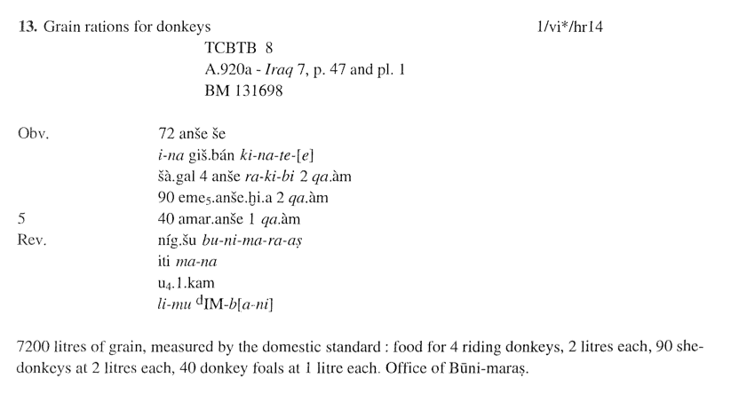

# Database management
This and the following two modules (see [2.5](./2_5_mysql.md) and [2.6](./2_6_mysql.md)) will introduce you to the basics of creating, using, and managing databases. We will first introduce some basic elements of tabular data and database formats, using examples from a number of different applications, including spreadsheets, desktop database programmes, and larger, multi-user database servers.

## Introduction
What is a database? A database, put simply, is a structured collection of data. Yesterday (see [1.5](./1_4_data_collection.md)), we discussed the definition of and types of data available from various resources in Assyriology. When confronted with large research databases that have been compiled by a large number of people over many years, you may come to think of databases as something very complex and difficult to oversee. It is important to remember, however, that all databases have to start out somewhere, and generally tend to rely on the same, relatively limited set of foundational elements.

It is equally important to remember that databases are collections of data developed around a specific set of research questions, and in order to address these questions in specific ways. Consequently, databases can have very different formats and outlooks in terms of the information they contain. 

* [Data tables](#data-tables)
* [Data types](#data-types)
* [Structuring data in plain text](#structuring-data-in-plain-text)
* [Structuring data in spreadsheets](#structuring-data-in-spreadsheets)
* Sorting and filtering

## Tasks

* [Create a basic .csv](#create-a-basic-csv)

#### Applications
No applications will be required for these modules.

### Data tables
When talking about databases in these modules, we will be talking about relational databases. At their very base, relational databases are organised around **tables** that can be related to each other in a wide range of ways. Tables are comprised by any given number of **columns** and **rows**. As you will all probably know, since you have all tried to use a bus or train schedule or order a concert ticket with different ticket categories or prices, **columns** and **rows** serve different purposes. **Columns** contain one specific **data type** storing data referring to one specific conceptual **variable**. **Rows** are observations made and recorded in said data types and according to said variables. Thus, for example:

fruit | colour | number
-------|--------|-------|
apple | red | 3 
orange | orange | 4 
pear | green | 2

### Data types
The data type used for each column has a significant impact on the ways in which data can be analysed (we cannot computationally calculate a total for all fruits based on text data such as 'two' and 'four'). The variable or category defined by each column essentially dictates what we can and cannot talk about when examining observations contained in individual rows. For example, we might consider a fox and a whale more closely associated than a cow based on their identical number of bellies, but the table in itself will not tell us if these animals live in water or on land.

In virtually all standard relational databases, we find data ordered and stored according to a few basic types, which, at their most basic level, can be defined as follows:

name | description
-----|--------------
string | also called _text_ or _character_ field, storing any number of encodable characters
number | can be either _whole numbers_, also called _integer_, or _fractions_, also called decimal numbers or doubles
date | any calendar date comprised by year, month, day, and time

This can be divided into more specific classes, particularly as regards numerical fields, but generally speaking, 

### Structuring data in plain text
When knowing the formal conventions of these data types, you can easily write a data table in plain text, using a format such as .csv or .tsv. If taking the example above, first in .csv (Comma Separated Values):

animal,colour,limbs,bellies 
fox,red,4,1 
whale,blue,2,1 
cow,black,4,4 

\- and below in .tsv (Tab Separated Values)

animal  colour  limbs   bellies 
fox red 4   1 
whale   blue    2   1 
cow black   4   4 

While you are unlikely to write anything beyond When properly structured and formatted, both of these plain text formats can be readily imported into just about any database application that you will ever use. Plain text formats such as these are important to master because they constitute some of the simplest and most compatible formats in which to store and share data.

### Structuring data in spreadsheets
[Spreadsheets](https://en.wikipedia.org/wiki/Spreadsheet) are computer applications built for the organisation and analysis of tabular data. As most of them are originally designed for accounting and bookkeeping, their primary toolbox is oriented towards calculation and statistics, but they can be used in virtually any context that involves tabular data.

All spreadsheet applications are structured around **cells** arranged into a grid of **columns** and **rows**, forming a table. Cells can contain any one of a range of data types, including text, number, and date. A cell is located within a grid according to its tabular position, namely **column name** and **row number**. So, for example, cell 'A2' is the first column (A), second row (2).

An individual table within a spreadsheet application is typically referred to as a **sheet**. The entire spreadsheet file is typically referred to as a **workbook**.

Cells, sheets, and workbooks can be linked across cells, sheets, and workbooks, provided that the correct link is given. Consider for example the following address:

                    ='[Workbook1.ods]Sheet1'!C2

\- where **[Workbook1.ods]** is the workbook file name (including file format extension), **Sheet1** is the sheet, and **C2** the cell within this sheet.

### Create a basic .csv
To illustrate simple structuring of data, let us do a small exercise, using an administrative cuneiform text from the Old Babylonian period as an example. The text is [BM 131698](https://www.britishmuseum.org/collection/object/W_1954-0510-9) and published as no. 13 in [Talon (1997) _Old Babylonian Texts from Chagar Bazar_](https://www.zotero.org/groups/2345127/items/D44PYT23).

1. Open a new text file in VS Code
2. Locate and download the excerpt [Talon 1997 no. 13](./_files/2_4_obtcb_13_talon_1997.png) from the DAA Summer School repo on GitHub ([glow-gh/daa/_files/2_4_obtcb_13_talon_1997.png](glow-gh/daa/_files/2_4_obtcb_13_talon_1997.png))
3. First read through the transliteration and translation of OBTCB 13 and identify column variables to be defined
4. Write a .csv data file including the column variables defined and record for each entity mentioned in the text
4. Save the text as a .csv named **obtcb_13.csv** and commit the file to your **daa** repository on GitHub
5. Compare and discuss different ways of structuring this text with the rest of the group

### The right database for the right task
In the following, we will be looking at a number of different types of databases, and how they are deployed. Throughout, you are encouraged to think about how these examples align with the tasks that you would imagine yourself dealing with in study or research. In many cases, a certain type of database may be _too_ complex for your needs.

### Spreadsheets for data entry and linking
First, let us look at an example of deploying spreadsheets with controlled value lists in manual data collection. This is used for artefact metadata collection within [Geomapping Landscapes of Writing](https://www.lingfil.uu.se/research/assyriology/glow/), and serves as a front-end to an assembly line that includes RStudio for data import and MySQL server for database storage.

A copy of the file can be downloaded from the DAA course repository ([click this link](https://github.com/glow-gh/daa/raw/main/_files/2_4_glow_entry_template.xlsx)), but note that it will require Microsoft Excel in order to run properly. 

The setup utilises the interoperability of cells across sheets in a workbook, including 11 sheets with up to 35 columns. By maintaining links between corresponding cells in various sheets, a lot of processes are automated and potential sources of error during data entry minimised 

#### Controlled value lists
A central element in this workbook is the use of controlled value lists that are drawn from the MySQL database and kept in a specific sheet (**3_values**). These lists define the range of different values that can be applied to a record within any given category, and are linked to all cells in the data entry sheet (**1_entry**)

### Use of unique identifiers
Another feature is the inclusion of dedicated primary identifiers for each record. This is a common standard procedure in most database applications, but you will still regularly run into databases in cuneiform studies that are poor at maintaing primary identifiers separate from actual data fields

Consider the following example:

fruit | colour | number
-------|--------|-------|
apple | red | 3 
orange | orange | 4 
pear | green | 2

\- as oppposed to:

id | fruit | colour | number
---|-------|--------|-------|
1 | apple | red | 3 
2 | orange | orange | 4 
3 | pear | green | 2

While neatly ordered, the problem with the first example here is the absence of any independent primary identifier. This may potentially compromise the insertion of links between records in different tables, as you will then be dependent upon values in the data fields staying unchanged in order to maintain links. The latter example would use the id as primary identifier, while allowing any other data field in the record to undergo changes and still maintain a link

### Function of linked cells
As this workbook is designed for manual data entry of a large amount of information, minimising the source of error is key. As such, the use of linked cells and functions in cells serve to automatically transfer data entered manually into **1_entry** to a dedicated import sheet, for example **x1_artifacts**. Data in the import sheet is then checked for inconsistencies automatically when importing to a database through RStudio.

### Desktop database applications
A more classy database application is FileMaker Pro, which many of you will probably have heard about, or encountered in research or in class. FileMaker Pro has historically been quite popular in Assyriological research, as it offers a graphical user interface for building databases without necessarily learning a significant amount of programming.

Filemaker is a proprietary and increasingly expensive piece of database software, offering a very comprehensive and versatile set of tools to construct large databases, that can be based on personal computers as well as servers and used by a large number of people at the same time.

### Handling imagery
Part of the appeal of FileMaker to Assyriologists has quite obviously been its ability to handle imagery. While spreadsheets are not made to handle pictures, imagery can be easily integrated into a FileMaker database, as shown here.

### Storage formats
A problem with some proprietary software solutions is that they rely on database formats that are not easily shared or converted, or regularly updated to newer versions. This is a critical issue if you plan on a database to exist for a longer timespan (and most people do so), as the database may become locked in a format from which it cannot be extracted without significant knowledge loss. 

In the case of FileMaker, for example, an older FileMaker database running on the database format .fmp7 can only be upgraded to the current .fmp12-format by purchasing the corresponding FileMaker software package. To avoid excessive maintenance costs and loss of data sharing capability, always opt for tested and non-proprietary storage formats if at all possible.

### Server-based database applications
Our final example is the main database of [Geomapping Landscapes of Writing](https://www.lingfil.uu.se/research/assyriology/glow/), which is made in MySQL and modelled on a scaled-down and simplified version of the database of the [Cuneiform Digital Library Initiative](http://cdli.mpiwg-berlin.mpg.de).

MySQL can be operated on a local drive with MySQL Server installed, and used through the graphic user interface (GUI) that you see here with MySQL Workbench and MySQL Connector installed. It is designed for very large bodies of data, however, and so unless you are looking to do several relational tables with several thousand records, it's a bit overkill

### Online databases, linked open data, and digital research environments

### Discussion

* What kind of task could you see yourself apply a database to?
* What type of database would that require?
* 

