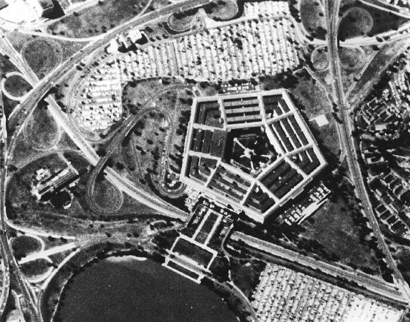

# QGIS

## Introduction
The last module introduced you to the basics of spatial data and the structure of Geographical Information Sytems, or GIS. In this module, we will work with [QGIS](https://qgis.org/en/site/), a free open source GIS application.

Initially, we should note that there are a wide range of GIS applications to choose from depending on the needs one might have and the software environment one is inclined to be working within. Different operating systems and database solutions will often influence the choice of GIS deployed.

Being used by planners, researchers, and engineers around the world, [ArcGIS](http://www.esri.com/software/arcgis), a proprietary commercial software produced and maintained by [Esri](https://www.esri.com/en-us/home), is certainly the flagship amongst GIS applications, offering a very extensive and carefully curated set of tools and solutions, as well as cloud-based services and servers. The license comes with a hefty price tag, however, and will only run on Windows operating systems.

The relational database software [PostgreSQL](https://www.postgresql.org), using a coding language closely associated with that of MySQL that we saw yesterday (see [2.5 MySQL](./2_5_mysql.md)) can be expanded with a GIS extension called [PostGIS](https://postgis.net), which adds support for geographic objects and allows for spatial queries to be run in SQL. While powerful and versatile, using it requires a more thorough understanding of SQL database structures than what we are able to provide here.

So, we arrive at [QGIS](https://qgis.org/en/site/). This is the most widely used free and open-source GIS application currently available. This module will introduce you to the QGIS user interface, setting up projects and adding some basic data to the map viewer.

#### Applications
* [QGIS](https://www.qgis.org/) - a free open source GIS

#### Resources
* [Goodchild 2008](https://citeseerx.ist.psu.edu/viewdoc/download?doi=10.1.1.162.1444&rep=rep1&type=pdf) - an article on spatial accuracy of community spatial data

## Tasks

* [The QGIS user interface](#the-qgis-user-interface)
* [Creating and saving projects](#creating-and-saving-projects)
* [Using Coordinate Reference Systems](#using-coordinate-reference-systems-crs)
* [Adding map tiles](#adding-map-tiles)
* [Adding georeferenced maps](#georeferencing-raster-images)
* [Using Corona imagery](#using-corona-imagery)

### Working with GIS
Before starting, a few notes on working with GIS applications:

* Remember that GIS applications routinely have to load very large amounts of graphic material and perform a load of calculations relating to the spatial dimension of the data. This will impact significantly on your laptops performance, so it is advisable to close other major applications
* Remember that some data files are loaded from remote sources, for example XYZ tiles, and this will burden your internet connection

### The QGIS user interface
Always remember that GIS software is widely used in a range of disciplines. Consequently, you will find an immense amount of resources online relating to just about any question about GIS. The main thing is learning a bit of the jargon used with GIS software and to have a bit of patience, then searching online should help you solve just about any problem that you are liable to run into. For QGIS, for example, you can find comprehensive [documentaion and training material](https://qgis.org/en/site/forusers/index.html#trainingmaterial) online.

A [user interface (UI)](https://en.wikipedia.org/wiki/User_interface) or [graphical user interface (GUI)](https://en.wikipedia.org/wiki/Graphical_user_interface) is the application window and associated tools of the programme that you see on the screen. In QGIS 3.x, the default settings will start you with the following components:
* The map **Viewer** panel or **Canvas** in the centre of the GUI, which shows layer data listed in
* the **Layers** panel in the left-hand side of the GUI, loaded from the
* file **Browser** panel in the above left-hand side of the GUI. Data appearing in the map **Viewer** and **Layer** panels can be manipulated using
*  a selection of **toolbars** in the upper part of the window. 
* In the bottom part of the GUI frame, you will find basic search and location tools, for example the coordinate location of the cursor (according to the CRS of the map panel), the scale at which the map panel is shown, and the current CRS of the map Viewer.

All of these GUI components are common to most GIS software, even if the arrangement and naming conventions sometimes differ. Many of the functions found in the **Toolbar** panel are also available from the generic top bar menus, especially **Project**, **Edit**, **Vector**, and **Raster**. The toolbars can be customized and augmented using **View > Toolbars**. More panel menus can be added using **View > Panels**. If you cannot find a function or menu item, you can use the search function of the **Help** menu tab. If you cannot find a tool, function or data layer, you can try the **Search** function on the bottom left.

### Creating and saving projects

A document in QGIS is called a **project**. A **project** file is **_not_** the data that is shown in the GUI when working with the project file, but a specific file session that data can be imported to for visualisation and editing or exported from for use with other applications. Spatial and attribute data files are separate from a project file and can be used across multiple projects.
1. To set up a new project, either press **Cmd + N** or press the **New Project** button in the **Toolbar** panel or choose **Project > New Project** from the menu. 
2. To save the project, either press **Cmd + S** or press the **Save Project** button in the **Toolbar** or choose **Project > Save** from the menu.
3. When saving a project, make sure **a)** that you know where to find it again and **b)** give the project file a name that is sensible and relates to what it is about. In general, GIS projects tend to generate a lot of data files, so set up a dedicated folder for all GIS related work and within that at least **a) folder for project files**, **b) a folder for spatial data files**, and **c) a folder for other data files**, such as attribute data tables.
4. QGIS will use one of two standard XML-based file formats for storing projects, namely **.qgs** and **.qgz**, the latter being a zipped (or compressed) version of the former.

### Using Coordinate Reference Systems (CRS)
A [coordinate reference system (CRS)](https://en.wikipedia.org/wiki/Spatial_reference_system) constitutes the formal mapping basis of any spatial data application. Any piece of spatial data is located in space according to its position within a given **CRS**. Note that the **CRS** of a spatial data entity may be different from the project **CRS**.
In **QGIS**, project **CRS** can be inspected and altered by clicking the **CRS** field in the bottom right corner of the screen. This will take you to the **CRS** pane of the **Project Properties** window, where **CRS** can be found and set. You will need to set the **CRS** of spatial data files separately, so always remember what **CRS** you are using.

There is a very large number of different **CRS** to choose from in any GIS application. Some are national or local systems (meaning that they are designed for accurately surveying the territory or parts of a territory of a specific nation or district), some are global or continental (meaning that they cover substantial parts of the entire globe), and some are devised for specific institutions, e.g. science or military purposes. We will not go into too much detail here, but you can read more about CRS in the QGIS documentation [Working with CRS](https://docs.qgis.org/3.22/en/docs/user_manual/working_with_projections/working_with_projections.html).

There are, however, a few important things to keep in mind when working with CRS:
* A CRS attempts to represent the surface of the globe on a two-dimensional surface, either on paper or on a computer screen. Consequently, all CRS converts a sphere into a surface, which will necessarily lead to distortion of parts of the resulting image. In other words, no CRS is perfect in a general sense of the word, but some are better for certain purposes than others.
* There are two general types of CRS; [geographic systems](https://en.wikipedia.org/wiki/Geographic_coordinate_system) and [projected systems](https://en.wikipedia.org/wiki/Projected_coordinate_system). A geographic CRS uses a spheroid base and gives positions as degrees measured from a specific datum on this sphere (for example Greenwich, England). A projected CRS converts the globe to a two-dimensional surface with X- and Y-axes intersecting at right angles and gives positions as XY-coordinates within the resulting grid.
* The choice of which CRS to use depends on what you want to do. Global systems are necessary when working with data from across multiple continents, but most of the time you will need something designed for a smaller area. A good **standard geographic CRS** format to use is [WGS 84](https://en.wikipedia.org/wiki/World_Geodetic_System) (CRS authority ID [EPSG: 4326](https://epsg.io/4326)).
* If working with a specific area or region, which is what you will be doing most of the time, a good **standard projected CRS** is the WGS 84 with a specified [UTM (Universal Transverse Mercator system)](https://en.wikipedia.org/wiki/Universal_Transverse_Mercator_coordinate_system) zone. The UTM format divides the Earth’s surface into separate zones, and then provides a local grid reference system for each of these zones. For Baghdad, for example, the WGS 84 UTM grid reference in QGIS will be 38N. For most of Syria, Jordan, Lebanon, and Israel, the UTM grid reference will be 37N.
* The choice of CRS may also depend on which data you want to use. [XYZ map tiles](https://en.wikipedia.org/wiki/Tiled_web_map) are generally made for projected CRS systems, and so they will take longer to load if using a geographic CRS, because the imagery will have to be reprojected by the programme first.

1. Set the project CRS to **WGS 84 / UTM zone 38N**.

### Adding map tiles
Now, let us add some data to the project. The first thing you would want if working with larger areas (as in, larger than an archaeological excavation, for example) is a background map or image, either for finding your way around or to create and edit data from. Before the birth of web mapping, this would be accomplished with a scanned and georeferenced (located by correct coordinates) map added to the map Viewer in a raster format. This solution, however, can be very data-heavy, and will therefore give you longer loading times or cause the programme to crash.

Most proprietary GIS software (like [ArcGIS](http://www.esri.com/software/arcgis) will nowadays provide base maps for use as a background reference or for illustration, which are drawn from an online map server. In open-source GIS software, you can add these yourself. Many online [web mapping services (WMS)](https://en.wikipedia.org/wiki/Web_Map_Service) provides base maps or base imagery free of charge in the form of XYZ [map tiles](https://en.wikipedia.org/wiki/Tiled_web_map). A map tile is a digital ‘slice’ or tile of a larger map. Acquiring the data in tile form means less loading time than if you were using a single map file (of the world, for example) in raster format.

[Google Maps](https://www.google.com/maps), [OpenStreetMaps](https://www.openstreetmap.org), and [Microsoft Bing](https://www.bing.com) all offer free access to background maps and imagery. Apple Maps have better imagery in some places but is not yet available for use as map tiles within GIS applications. You can load map tiles to QGIS by establishing a link to their **WMS** address online, using the **XYZ Tiles** function in the **Browser** pane. First, let’s try to load **OpenStreetMap**, which comes as a standard link with QGIS 3.x:
1. Find and expand **XYZ Tiles** in the **Browser** panel
2. Right-click **OpenStreetMap**
3. Choose **Add Selected Layer(s)** to Canvas
4. You should now see a static version of the OpenStreetMap world map on the map canvas. Please zoom in on southern Iraq before proceeding

You can add other XYZ map tiles as separate layers in the same project. OpenStreetMaps (or OSM) is generally one of the best digital maps that you can find freely available online. If you want imagery (from aeroplanes or satellites), then [Google Earth](https://earth.google.com/web/) and [Microsoft Bing](https://www.bing.com) web maps are good solutions for this kind of background image, but the quality of one or the other varies depending on where in the world that you are.

XYZ map tiles from these resources can be used virtually all over the globe. You should note, however, that the spatial accuracy of Google Earth or Bing imagery is not necessarily better than other resources. Imagery from Google Earth will, as a rule of thumb, **be offset from the real location with anywhere between 10 and up to 40 m**, and the same is likely the case for Bing imagery. You can find an interesting essay about the accuracy of spatial data online in [Goodchild 2008](https://citeseerx.ist.psu.edu/viewdoc/download?doi=10.1.1.162.1444&rep=rep1&type=pdf).

### Adding georeferenced map
Now we have background images and some imagery from which to build vector data. The next step is going closer to what we actually want to look at and provide some context for that. Let’s start with maps. Most of the Middle East has been consistently mapped by a number of national survey agencies since the early 20th century. A good many of these maps are available in a digital form and can therefore be integrated with GIS.
Normally, you would need to locate the digital map resource, acquire the map in a high-resolution image file (**.jpg** or, ideally, **.tiff**) and then **georeference** the map in order to locate it correctly within the given CRS. To **georeference** a raster means to reference the image to a set of known geographical coordinates, allowing us to overlay the image on the corresponding part of the Earths surface.

Here, we will use an already georeferenced map from a collection of maps made by the [US Army Map Service](https://en.wikipedia.org/wiki/Army_Map_Service) in the 1930ies and 1940ies. Print maps (and digital maps as well) often recycle information from earlier maps. In this case, the US AMS maps of the Middle East draw extensively on the British [Survey of India](https://en.wikipedia.org/wiki/Survey_of_India) maps from the 1920ies and 1930ies. These are some of the earliest, geographically most reliable (they are relatively precise), and regionally comprehensive (they cover more than just a place or a city) maps of the Middle East that can be found.

1. Download the georeferenced map **H-38K_Suq_Ash_Shuyuk**
2. Create a folder in your **daa** directory named **qgis** and save the map file to this folder
3. Go to QGIS and navigate to the map file through the **Browser** panel
4. Double-click the file to add it to the **Layers** panel
5. You will then be asked to set the CRS of the image file. Choose **WGS 84 / UTM 38N**
6. Right-click the image layer in the **Layers** panel and choose **Zoom to layer**

### Using Corona imagery
You have now been introduced to the very basics of georeferencing raster data for use in GIS projects. This can be used for maps, which usually contain a lot of information on the coordinates they should be mapped to. The same approach can also be used to overlay imagery, such as aerial photography recorded by aircraft or satellites, but such data requires considerably more preparation than maps to be reliable. Hence, we will not be covering georectification of satellite imagery here. 

We will, however, introduce you to a very important resource for working with archaeological remains and historical research in the Middle East, namely declassified spy satellite imagery. This resource primarily stem from a couple of top-secret surveillance programmes run by the US [Central Intelligence Agency](https://en.wikipedia.org/wiki/Central_Intelligence_Agency) in the 1960s and ‘70s, which if you have heard of them, you probably know by the name [Corona](https://en.wikipedia.org/wiki/CORONA_(satellite)). Photographs were taken of select areas of the Earth by low-orbit (c. 120 km) satellites with extremely powerful cameras, providing black/white imagery with a ground resolution of between 2.5 and down to 0.5 m. For publicly accessible imagery, this kind of ground resolution detail only came about with the appearance of [Google Earth](https://en.wikipedia.org/wiki/CORONA_(satellite)) in 2001.

Much of the previously classified imagery from the Corona missions was made publicly available in the mid-1990s. Archaeologists have used this resource extensively, as it allows you to study the Middle East landscape before increasing urbanisation, public infrastructure, and industrialised agriculture had begun to have a significant impact on the environment. The problem is that Corona images are extremely time-consuming to georectify. Each image from a Corona satellite has been taken through a 70 ̊ wide-angle lens to cover as much ground as possible in each frame. Because of the need to record elevation and landscape and feature relief, later satellites carried two cameras, one fore and one aft, taking pictures in stereo. From a station of orbit c. 120 km above the ground, this means that you are looking at a picture taken from a slight oblique angle of a strip of land c. 200-150 km long and c. 30-50 km wide (which, by the way, is placed on a sphere, not a plane surface).

One research project, the [Center for Advanced Spatial Technologies (CAST)](http://cast.uark.edu) at the University of Arkansas, has made a complete library of georeferenced imagery for most of the Middle East that can be downloaded and used in GIS (but beware, **one georectified Corona image in .tiff-format will take up c. 0.5 GB of storage**). This resource can be searched in an online WebGIS application, where you can also download images:

1. Download the clipped Corona image 
2. Save the image file to your **qgis**
3. Go to QGIS and navigate to the image file through the **Browser** panel
4. Double-click the file to add it to the **Layers** panel

Take some moments to compare the information available from the map and satellite image respectively, for example by finding the ancient city of Ur.