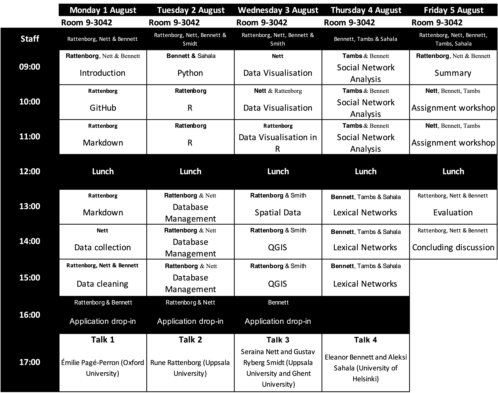

# Welcome aboard!
The following pages contains module summaries and materials for the course programme of the Digital Applications in Assyriology (DAA) Nordic Summer School 2022. The summer school is jointly organised by project staff of [Geomapping Landscapes of Writing (GLoW)](https://www.lingfil.uu.se/research/assyriology/glow/) at Uppsala University and [Ancient Near Eastern Empires (ANEE)](https://www2.helsinki.fi/en/researchgroups/ancient-near-eastern-empires) of the University of Helsinki, with further financial support from the [Ancient Middle Eastern Nordic Network (AMENN)](https://ccrs.ku.dk/education/amenn/).

## Aims
The DAA aims to provide students in Assyriology with a working knowledge of core digital applications for the creation, curation, analysis and visualisation of digital data. 

The five-day programme focuses specifically on real-world cases from the field of Assyriology and related fields presented by researchers actively engaged with ongoing and digitally oriented research projects at the organising institutions and elsewhere. Next to a solid working knowledge of digital applications and their use in the field of Assyriology, the summer school will give participating students an opportunity to meet and join in training with students from other Scandinavian countries, as well as a diverse range of scholars from universities in Sweden, Finland, Denmark, and beyond. 

The summer school is intended for students in Assyriology or closely related fields without much prior experience in the application of digital tools to the study of cuneiform sources or related materials. Preference will be given to BA- and MA-level students from higher research institutions in the Scandinavian countries, but the summer school is open to participants from all nations.

## Programme
The school extends over five full days, consisting of morning sessions with hands-on training in a variety of computing applications, followed by afternoon sessions with lectures and discussions from teaching staff and invited speakers. Following the successful completion of the summer school, students will be given one week for independent project work to be submitted by 12 August 2022 at the latest. Participants who successfully complete the summer school programme and independent project will receive a certificate of completion with which the students can apply to their home universities to receive study credits. However, the summer school cannot guarantee that all universities will give study credit for the course. Overall, the summer school will give the participants:

* an in-depth understanding of file formats and information search and management
* ways of collecting, cleaning, and integrating text and data
* knowledge of online data structures and the use of linked data
* setting up and working with relational databases
* basic visualisation methods for exploring and communicating data
* structure and use of map resources and geographical information systems
* preparing data for and working with social network analysis
* using and exploring lexical networks
* the ability to execute a simple digital humanities research project under supervision

## Teaching staff
* [Rune Rattenborg](https://katalog.uu.se/profile/?id=N18-1120)
* [Seraina Nett](https://katalog.uu.se/profile/?id=N17-2334)
* [Ellie Bennett](https://www2.helsinki.fi/en/researchgroups/ancient-near-eastern-empires/researchers/team-1-digital-humanities-approaches/people#section-78378)
* [Lena Tambs](https://www2.helsinki.fi/en/people/people-finder/lena-tambs-9428671)
* [Aleksi Sahala](https://www2.helsinki.fi/en/people/people-finder/aleksi-sahala-9113715)
* [Stefan Smith](https://www2.helsinki.fi/en/people/people-finder/stefan-smith-9439288)

